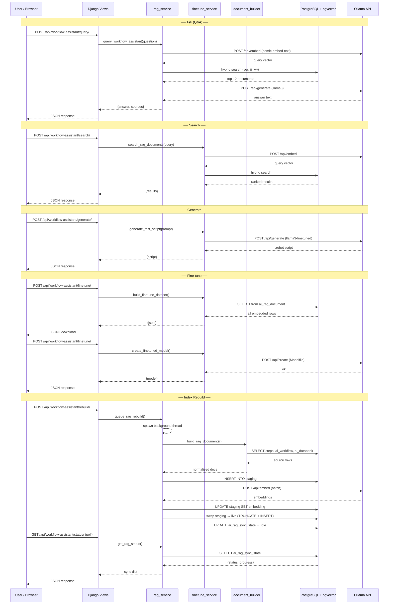

# LLM Workflow Assistant — RAG + Fine-Tuning for WebConX

A Django-integrated AI assistant that indexes WebConX automation data (recorded
steps, saved workflows, databank objects) into a **pgvector** vector store and
exposes four capabilities through a single-page UI:

| Tab | What it does |
|-----|-------------|
| **Ask** | Natural-language Q&A — retrieves relevant documents via hybrid search, then streams an Ollama-generated answer |
| **Search** | Direct hybrid (vector + keyword) search — returns ranked document cards, no LLM generation |
| **Generate** | Asks Ollama to write a Robot Framework `.robot` test script from a natural-language description |
| **Fine-tune** | Builds a JSONL training dataset from indexed docs and creates a custom Ollama model with a baked-in system prompt |

---

## Architecture at a Glance

```
┌────────────────────────────────────────────────────────────────┐
│  Browser — Bootstrap 5 UI with 4 pill tabs                     │
│  workflow_assistant.html                                       │
└────────────────────┬───────────────────────────────────────────┘
                     │  fetch()
┌────────────────────▼───────────────────────────────────────────┐
│  Django Views  (recorder/views.py)                             │
│  8 endpoint handlers                                           │
└───┬───────────┬───────────┬──────────────┬─────────────────────┘
    │           │           │              │
    ▼           ▼           ▼              ▼
rag_service  finetune_service  document_builder  rag_service
 .py          .py               .py               (rebuild)
    │           │                │                 │
    ▼           ▼                ▼                 ▼
 PostgreSQL + pgvector        Source tables     Ollama API
 ai_rag_document (live)       - steps           localhost:11434
 ai_rag_document_staging      - ai_workflow
 ai_rag_sync_state            - ai_databank
```

---

## Main Files

| File | Role |
|------|------|
| `__init__.py` | Package marker |
| `rag_service.py` | RAG orchestration — schema creation, staged rebuild, embedding, hybrid retrieval, query answering, progress tracking, stale-state detection |
| `document_builder.py` | Builds normalised documents from `steps`, `ai_workflow`, `ai_databank` |
| `finetune_service.py` | Dataset export (JSONL), custom Ollama model creation, test-script generation, direct RAG search |

### Django integration

| File | What was added |
|------|---------------|
| `recorder/views.py` | 8 view functions for the assistant page and API |
| `recorder/urls.py` | 8 URL routes (see [API Endpoints](#api-endpoints)) |
| `recorder/templates/recorder/workflow_assistant.html` | Full single-page UI with 4 tabs |

---

## Source Tables Used

| Table | Description |
|-------|-------------|
| `steps` | Recorded browser automation steps (action, locator, value, page, URL) |
| `ai_workflow` | Saved/curated automation workflows |
| `ai_databank` | Shared data objects referenced by workflows |

Each row is transformed into a normalised **document** by `document_builder.py`.

---

## Document Shape

Every document stored in `ai_rag_document` has:

| Column | Purpose |
|--------|---------|
| `source_type` | `steps` · `ai_workflow` · `ai_databank` |
| `source_key` | Original table PK |
| `source_title` | Human-readable title |
| `document_text` | Full prose representation |
| `embedding` | `vector(768)` from `nomic-embed-text` |
| `embedding_model` | Model name used for the embedding |
| `metadata` | JSONB — extra fields for filtering in the future |

---

## Database Schema

Three tables managed by `rag_service.py`:

### `ai_rag_document` (live)

```sql
CREATE TABLE IF NOT EXISTS ai_rag_document (
    id              BIGSERIAL PRIMARY KEY,
    source_type     TEXT NOT NULL,
    source_key      TEXT NOT NULL,
    source_title    TEXT,
    document_text   TEXT,
    embedding       vector(768),
    embedding_model TEXT DEFAULT 'nomic-embed-text',
    metadata        JSONB DEFAULT '{}',
    created_at      TIMESTAMPTZ DEFAULT now(),
    UNIQUE(source_type, source_key)
);
```

### `ai_rag_document_staging`

Identical schema. Used during rebuilds so the live table stays queryable.

### `ai_rag_sync_state`

```sql
CREATE TABLE IF NOT EXISTS ai_rag_sync_state (
    id               BIGSERIAL PRIMARY KEY,
    status           TEXT DEFAULT 'idle',    -- idle | queued | running
    started_at       TIMESTAMPTZ,
    finished_at      TIMESTAMPTZ,
    indexed_documents INTEGER DEFAULT 0,
    total_documents   INTEGER DEFAULT 0,
    completed_documents INTEGER DEFAULT 0,
    error_message    TEXT
);
```

---

## Vector Store

- **Extension**: `pgvector` (`CREATE EXTENSION IF NOT EXISTS vector`)
- **Dimension**: 768 (matches `nomic-embed-text`)
- **Distance metric**: cosine (`<=>` operator)
- **IVFFlat index** on `ai_rag_document.embedding` for approximate nearest-neighbour lookup

---

## Models

| Role | Model | Endpoint |
|------|-------|----------|
| **Embedding** | `nomic-embed-text` | `POST /api/embed` |
| **Generation / Q&A** | `llama3` (or custom `llama3-finetuned`) | `POST /api/generate` |
| **Fine-tuned** | `llama3-finetuned` | Created via `POST /api/create` with baked-in system prompt |

All models are served locally by **Ollama** at `http://localhost:11434/api`.

---

## Hybrid Search

Every query is scored by **both** vector similarity and keyword relevance:

```
hybrid_score = vec * 0.62 + kw * 0.38
```

| Component | How |
|-----------|-----|
| **Vector** | `1 - (embedding <=> query_vector)` via pgvector cosine |
| **Keyword** | `ts_rank_cd(to_tsvector(...), plainto_tsquery(...))` via PostgreSQL full-text |

Results are ranked by `hybrid_score DESC`, top-k (default 12 for Ask, 10 for Search).

---

## Staged Rebuild (Zero-Downtime)

Rebuilding the index never blocks queries:

1. `queue_rag_rebuild()` sets sync state to **queued** and spawns a background thread.
2. The thread truncates `ai_rag_document_staging`, inserts fresh documents, and embeds them in batches.
3. Progress is written to `ai_rag_sync_state` after each batch (`completed_documents`, `total_documents`).
4. On success, `_swap_staging_into_live()` runs inside a single transaction:
   - `TRUNCATE ai_rag_document`
   - `INSERT INTO ai_rag_document SELECT * FROM ai_rag_document_staging`
5. Status returns to **idle** with `indexed_documents` updated.

### Stale-state detection

If the server process crashed mid-rebuild, `get_rag_status()` detects orphaned
`running` / `queued` states (no live thread) and automatically resets to `idle`.

### UI progress

The template polls `GET /api/workflow-assistant/status/` every 3 seconds while a
rebuild is active and renders:

- Shimmer progress bar with percentage
- Done _n_ / _total_ counter
- Elapsed time
- Completion toast on finish

---

## Fine-Tuning

### Dataset building

`build_finetune_dataset()` reads every embedded row from `ai_rag_document` and
produces JSONL lines:

```json
{"instruction": "Describe the recorded automation step: …", "input": "", "output": "…"}
{"instruction": "Explain the saved workflow: …",           "input": "", "output": "…"}
{"instruction": "Describe the databank object: …",         "input": "", "output": "…"}
```

### Custom model creation

`create_finetuned_model()` calls `POST /api/create` with a Modelfile that
inherits from the base model and injects the WebConX system prompt:

```
FROM llama3
SYSTEM """You are the WebConX Workflow Assistant. …"""
```

The resulting model (`llama3-finetuned`) is immediately available for generation.

---

## Test-Script Generation

`generate_test_script()` sends a prompt to Ollama with a system message
instructing it to output valid Robot Framework `.robot` content using
SeleniumLibrary/Browser keywords, with setup, teardown, and assertions.

---

## API Endpoints

All routes are registered under `recorder/urls.py`:

| Method | Path | View | Purpose |
|--------|------|------|---------|
| GET | `/workflow-assistant/` | `workflow_assistant` | Render the full UI page |
| POST | `/api/workflow-assistant/query/` | `workflow_assistant_query` | Ask a question (RAG Q&A) |
| POST | `/api/workflow-assistant/rebuild/` | `workflow_assistant_rebuild` | Queue an index rebuild |
| GET | `/api/workflow-assistant/status/` | `workflow_assistant_status` | Poll rebuild progress |
| POST | `/api/workflow-assistant/search/` | `workflow_assistant_search` | Direct hybrid search |
| POST | `/api/workflow-assistant/generate/` | `workflow_assistant_generate` | Generate Robot Framework script |
| POST | `/api/workflow-assistant/finetune/` | `workflow_assistant_finetune` | Build dataset or create model |
| GET | `/api/workflow-assistant/finetune/status/` | `workflow_assistant_finetune_status` | Check fine-tuned model status |

---

## End-to-End Workflow

### Ask (Q&A)

1. User types a question in the **Ask** tab.
2. `POST /api/workflow-assistant/query/` → `query_workflow_assistant()`.
3. Query is embedded with `nomic-embed-text`.
4. Hybrid search retrieves top-12 documents.
5. Prompt is assembled: system instructions + retrieved context + user question.
6. `POST /api/generate` to Ollama `llama3` (or fine-tuned model).
7. Answer + source list returned to the UI.

### Search

1. User enters a keyword or phrase in the **Search** tab.
2. `POST /api/workflow-assistant/search/` → `search_rag_documents()`.
3. Same hybrid scoring — no LLM call.
4. Results rendered as scored cards with source metadata.

### Generate

1. User describes a test in the **Generate** tab.
2. `POST /api/workflow-assistant/generate/` → `generate_test_script()`.
3. Ollama produces a `.robot` script.
4. Script displayed in a syntax-highlighted code block.

### Fine-tune

1. **Build Dataset** → `POST /api/workflow-assistant/finetune/` `{action: "build_dataset"}` — exports JSONL.
2. **Create Model** → `POST /api/workflow-assistant/finetune/` `{action: "create_model"}` — calls Ollama `/api/create`.
3. **Check Status** → `GET /api/workflow-assistant/finetune/status/` — polls model availability.

### Index Rebuild

1. Click **Rebuild** button → `POST /api/workflow-assistant/rebuild/`.
2. Background thread truncates staging, builds docs, embeds in batches, swaps into live.
3. UI polls status every 3 s, shows progress bar, done count, elapsed time.
4. Toast notification on completion.

---

## Local Requirements

| Requirement | Version / Detail |
|-------------|-----------------|
| Python | 3.11+ |
| Django | 4.2+ |
| PostgreSQL | 14+ with `pgvector` extension |
| Ollama | Running at `localhost:11434` with `llama3` and `nomic-embed-text` pulled |
| `requests` | Any recent version |

---

## Repository Layout

```
llm_workflow_assistant/
├── __init__.py                 # package marker
├── rag_service.py              # RAG orchestration (Django-integrated)
├── document_builder.py         # document normalisation
├── finetune_service.py         # fine-tune, generate, search
├── .env                        # (gitignored) local overrides
│
├── api/                        # FastAPI controllers (standalone, not used by Django)
│   ├── chat_controller.py
│   ├── download_controller.py
│   ├── generate_controller.py
│   └── search_controller.py
│
├── db/
│   ├── ai_rag_document.sql     # reference DDL
│   └── pg_connection.py        # standalone PG helper
│
├── finetune/
│   ├── dataset_builder.py      # standalone dataset builder
│   ├── Modelfile               # Ollama Modelfile template
│   └── train_llama3.bat        # CLI training script
│
├── rag/
│   ├── rag_builder.py          # standalone builder
│   └── rag_retriever.py        # standalone retriever
│
├── tasks/
│   └── daily_rag_update.bat    # scheduled rebuild script
│
├── app.py                      # FastAPI entrypoint (standalone)
├── README.md                   # ← you are here
└── workflow_rag_sequence.mmd   # Mermaid sequence diagram
```

> **Note:** The files under `api/`, `rag/`, `finetune/`, `db/`, `tasks/`, and
> `app.py` are part of the original standalone FastAPI package.  The Django
> integration uses only `rag_service.py`, `document_builder.py`, and
> `finetune_service.py` (imported by `recorder/views.py`).

---

## Sequence Diagram

See [workflow_rag_sequence.mmd](workflow_rag_sequence.mmd) for the full Mermaid
source.  Rendered below:



---

## Real Query Walkthrough

```
User question:  "How does the Login workflow work?"
```

1. **Embed** — `nomic-embed-text` converts the question to a 768-dim vector.
2. **Hybrid search** — pgvector cosine + PostgreSQL `ts_rank_cd` score each document.
3. **Top-12 context** — documents about login steps, the Login workflow, any related databank entries.
4. **LLM prompt** — system instructions + context block + user question sent to `llama3`.
5. **Answer** — structured explanation citing step numbers, page names, locators, and URLs from the retrieved context.

---

## Summary

The Workflow Assistant turns raw WebConX automation data into an AI-searchable
knowledge base.  Users can **ask** questions, **search** the index directly,
**generate** Robot Framework scripts, and **fine-tune** a custom model — all
from a single Django page backed by PostgreSQL + pgvector and a local Ollama
instance.
