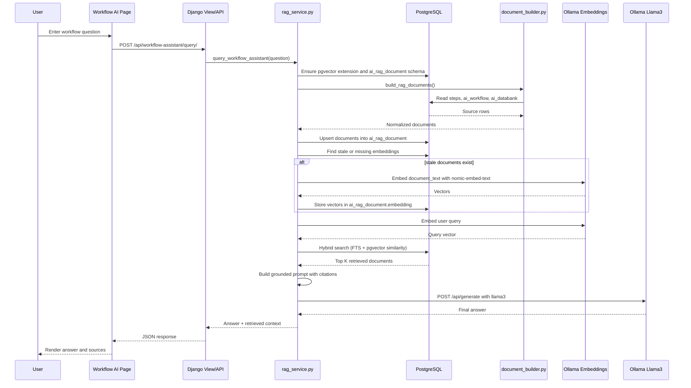

# Workflow Assistant

This package now powers the local Workflow AI experience inside the main Django app.

It uses:
- PostgreSQL as the source of truth for `steps`, `ai_workflow`, and `ai_databank`
- PostgreSQL + `pgvector` as the vector store
- Ollama `nomic-embed-text` for embeddings
- Ollama `llama3` for final answer generation
- Django for the UI and API integration

## What This Assistant Does

The assistant is designed to:
- interpret relationships between recorded PSQL steps, saved workflows, and databank objects
- explain workflows step by step
- summarize automation procedures
- detect dependencies and flow order
- cite from retrieved context when possible

This is implemented as local RAG, not fine-tuning.

## Current Architecture

The live architecture is:

1. Read source data from PostgreSQL tables.
2. Serialize each source row into a normalized RAG document.
3. Sync those documents into a PostgreSQL table named `ai_rag_document`.
4. Generate embeddings with local Ollama using `nomic-embed-text`.
5. Store those vectors in PostgreSQL using `pgvector`.
6. At query time, embed the user question.
7. Run hybrid retrieval using both keyword ranking and vector similarity.
8. Build a grounded prompt from the top retrieved documents.
9. Send that prompt to local Ollama `llama3`.
10. Return the answer plus retrieved source context to the app UI.

## Main Files

- `document_builder.py`
      Builds normalized RAG documents from `steps`, `ai_workflow`, and `ai_databank`.

- `rag_service.py`
      Orchestrates schema creation, document sync, embeddings, hybrid retrieval, prompt construction, and final LLM generation.

- `model/Modelfile`
      Defines the system behavior for the local Ollama model persona.

## Source Tables Used

The document builder reads from these PostgreSQL sources:

### 1. `steps`
Serialized fields include:
- `record_id`
- session `record_name`
- `step_no`
- `action`
- `page_url`
- `element_tag`
- primary locator strategy and locator
- bound data value
- validation text
- folder name
- tenant id

Each row becomes a document such as:
- `Step 9 · Login Flow`

### 2. `ai_workflow`
Serialized fields include:
- `workflow_name`
- `page_connections`
- `page_sequence`
- `workflow_payload.view_state`

Each workflow becomes a document such as:
- `Workflow · Login to Dashboard`

### 3. `ai_databank`
Serialized fields include:
- databank row id
- `page_name`
- `page_url`
- `element_type`
- locator strategies from `locator_property`
- tag name and text

Each row becomes a document such as:
- `Databank · Login Page · Row 825`

## Document Shape

Each serialized document follows a common structure:

- `source_type`
- `source_key`
- `title`
- `content`
- `metadata`
- `tenant_id`
- `source_updated_at`
- `content_hash`

This allows all source types to be indexed and searched through one vector table.

## Vector Store

The assistant creates and uses a PostgreSQL table named `ai_rag_document`.

Important columns:
- `source_type`
- `source_key`
- `source_title`
- `document_text`
- `metadata`
- `source_updated_at`
- `tenant_id`
- `content_hash`
- `embedding_model`
- `embedding`

Important indexes:
- unique index on `source_key`
- GIN full-text index for keyword search
- standard indexes for source type, tenant, and updated time

This table is the local vector store.

## Embedding Model vs Generation Model

These two roles are different:

### Embedding model
- model: `nomic-embed-text`
- purpose: convert documents and questions into vectors
- used for retrieval only

### Generation model
- model: `llama3`
- purpose: reason over retrieved evidence and produce the final answer
- used for answer generation only

Do not use `llama3` as the embedding model.

## Hybrid Search

Retrieval is hybrid, which means it combines:

### 1. Keyword search
PostgreSQL full-text ranking via:
- `to_tsvector(...)`
- `plainto_tsquery(...)`
- `ts_rank_cd(...)`

This helps with exact matches like:
- record names
- workflow names
- page names
- exact actions such as `submit`
- identifiers such as row ids or step numbers

### 2. Vector similarity
pgvector similarity via:
- `embedding <=> query_vector`

This helps when the wording is semantically similar but not exact.

### 3. Hybrid score
The final ranking score is a weighted combination:
- vector score weight: `0.62`
- keyword score weight: `0.38`

This gives better retrieval quality than either approach alone.

## End-to-End Workflow

This is the full live query path.

### Step 1. User asks a question
The Workflow AI page sends a POST request to the Django API endpoint.

### Step 2. Django calls `query_workflow_assistant`
The query is forwarded to `rag_service.py`.

### Step 3. RAG schema is ensured
The service ensures:
- PostgreSQL `vector` extension exists
- `ai_rag_document` exists
- retrieval indexes exist

### Step 4. Source documents are built
`document_builder.py` reads live rows from:
- `steps`
- `ai_workflow`
- `ai_databank`

### Step 5. Documents are synced into `ai_rag_document`
The service compares `content_hash` values to detect changed documents.

This means:
- new documents are inserted
- changed documents are updated
- deleted source documents are removed
- changed documents are marked for re-embedding

### Step 6. Missing embeddings are generated
Any stale or missing vector is generated by local Ollama using:
- `nomic-embed-text`

The embedding is stored in PostgreSQL.

### Step 7. The user question is embedded
The same embedding model converts the user question into a vector.

### Step 8. Hybrid retrieval runs in PostgreSQL
The system ranks documents using:
- keyword score
- vector score
- combined hybrid score

The top `k` documents are returned.

### Step 9. A grounded prompt is built
The top documents are formatted into a prompt that includes:
- source label
- title
- content
- citation metadata

### Step 10. Local `llama3` generates the answer
The grounded prompt is sent to Ollama generate API.

### Step 11. The app returns the answer and retrieved sources
The UI receives:
- answer text
- retrieved documents
- counts per source type

## Runtime Behavior Notes

Right now, document sync happens on query.

That is simple and correct for freshness, but it means a query may also trigger:
- document rebuilds
- embedding generation
- vector updates

For larger datasets, a separate background reindex flow would be better.

## Local Requirements

The local Ollama setup should include at least:

```powershell
ollama pull llama3
ollama pull nomic-embed-text
```

The app expects Ollama to be reachable at:

```text
http://localhost:11434/api
```

## Validated State

This implementation has already been validated with:
- Django `manage.py check`
- live PostgreSQL sync
- live Ollama embedding generation
- live hybrid retrieval
- live Llama 3 answer generation

The installed local embedding model is:
- `nomic-embed-text`

## Repository Layout

```text
llm_workflow_assistant/
├── README.md
├── document_builder.py
├── rag_service.py
├── test_llama3.py
├── run_assistant.bat
├── run_assistant.sh
├── model/
│   └── Modelfile
├── rag/
│   ├── config.yaml
│   └── scripts/
│       ├── chunk_text.py
│       ├── embed_chunks.py
│       └── query_rag.py
└── finetune/
            ├── prepare_dataset.py
            └── train_lora.py
```

## Summary

This assistant is now a real local RAG stack:
- PostgreSQL source data
- PostgreSQL pgvector storage
- Ollama embeddings
- hybrid search
- local `llama3` generation

It is designed to explain automation workflows from your live application data rather than from static documents alone.

## Sequence Diagram

The following sequence shows the live query path from the browser to PostgreSQL, embeddings, retrieval, and final generation.



## Database Schema: ai_rag_document

`ai_rag_document` is the unified retrieval table. It stores normalized documents from all supported source tables plus their vector embeddings.

### Core identity fields

- `id`
      Surrogate primary key for the retrieval row.

- `source_type`
      Identifies the origin table or logical source. Current values are:
      - `steps`
      - `ai_workflow`
      - `ai_databank`

- `source_key`
      Stable unique key for the source record. Examples:
      - `steps:<record_id>:<step_no>`
      - `ai_workflow:<workflow_name>`
      - `ai_databank:<row_id>`

### Content fields

- `source_title`
      Human-readable label used in retrieval output and prompt building.

- `document_text`
      The serialized text used for embeddings and keyword search. This is the actual chunk content retrieved later.

- `metadata`
      JSONB payload containing structured fields such as record name, page name, workflow connections, locator keys, and citation labels.

### Freshness and tenancy fields

- `source_updated_at`
      Mirrors the latest timestamp from the source data. Used to prioritize recent material.

- `tenant_id`
      Keeps tenant-scoped data separated where applicable. Retrieval allows matching tenant rows and global rows.

- `content_hash`
      Hash of the serialized title, content, and metadata. If this changes, the document is considered stale and is re-embedded.

### Vector fields

- `embedding_model`
      Stores the model name used to generate the current vector, for example `nomic-embed-text`.

- `embedding`
      `pgvector` column holding the dense embedding vector used for semantic retrieval.

### Audit fields

- `created_at`
      When the retrieval row was first inserted.

- `updated_at`
      When the retrieval row was last refreshed.

## Indexes on ai_rag_document

The table uses a few important indexes:

- Unique index on `source_key`
      Prevents duplicate retrieval rows for the same logical source record.

- GIN full-text index on `source_title + document_text`
      Supports keyword ranking through PostgreSQL full-text search.

- Standard indexes on `source_type`, `tenant_id`, and `updated_at`
      Improve source filtering, tenant filtering, and recency ordering.

The current implementation does not yet create an approximate nearest neighbor vector index. Vector similarity still works, but ANN indexing can be added later if retrieval volume grows.

## Real Query Walkthrough

The following example uses a real query that was already executed successfully in this repository:

```text
Which workflow or recorded steps mention login, textbox, or submit actions? Summarize the dependency flow and cite sources.
```

### Step 1. The Workflow AI page sends the query

The page posts the message to the Django API endpoint:

```text
/api/workflow-assistant/query/
```

### Step 2. Django forwards the request to the RAG orchestration layer

`workflow_assistant_query` calls:

```python
query_workflow_assistant(
            message,
            tenant_id=_get_user_tenant_id(request.user),
            ollama_api=ollama_api,
            model=ollama_model,
)
```

### Step 3. The service syncs source documents

`rag_service.py` calls `build_rag_documents()`, which reads:
- recent step rows from `steps`
- saved workflows from `ai_workflow`
- databank objects from `ai_databank`

Each is serialized into a normalized document and upserted into `ai_rag_document`.

### Step 4. Missing vectors are generated

If any document is new or stale, the service calls local Ollama embeddings using:

```text
model = nomic-embed-text
```

Those vectors are stored back in PostgreSQL.

### Step 5. The query itself is embedded

The same embedding model converts the user question into a query vector.

### Step 6. PostgreSQL runs hybrid search

The retrieval query calculates:
- `keyword_score` from full-text ranking
- `vector_score` from `embedding <=> query_vector`
- `hybrid_score` from the weighted combination

The top `k` results are selected.

In the validated run, the returned counts were:

```text
{'steps': 4, 'workflows': 0, 'databank': 4, 'documents': 8}
```

This means the top retrieved evidence consisted of:
- 4 step documents
- 4 databank documents
- 0 workflow documents

### Step 7. Example top retrieved source

In that run, the first retrieved source key was:

```text
ai_databank:825
```

That means a databank row was the strongest hybrid match for the query.

### Step 8. The grounded prompt is built

The service formats each retrieved document like this:

```text
[citation] title=<title> hybrid_score=<score>
<document_text>
```

For example, a step source can appear in the prompt as:

```text
[steps:Populate Textbox Field#step-9] title=Step 9 · Populate Textbox Field hybrid_score=0.3060
Record name: Populate Textbox Field
Record id: d17178d2-46f9-4e08-a703-388a35adbddc
Step number: 9
Action: click
Page URL: https://demoqa.com/text-box
Element tag: button
Primary locator: robot id:submit
Data value: Submit
Validation:
Folder:
```

### Step 9. Llama 3 generates the final answer

That grounded prompt is sent to local Ollama using:

```text
model = llama3
```

Llama 3 then writes a natural-language summary based only on the retrieved documents.

### Step 10. Example of the generated response shape

The validated run produced an answer that began by identifying the retrieved step and databank evidence and then summarized the likely dependency flow around textbox and submit actions.

In practice, the answer looked like:
- identify a matched step on `https://demoqa.com/text-box`
- mention the `submit` locator
- summarize that the flow includes form population followed by a submit action
- cite retrieved step/databank labels where available

## Why This Example Matters

This example shows the full chain is live and local:
- PostgreSQL source read
- document serialization
- pgvector storage
- Ollama embeddings
- hybrid retrieval
- grounded prompt creation
- Ollama `llama3` generation

That means the assistant is not answering from generic model memory alone. It is reasoning over your current application data.